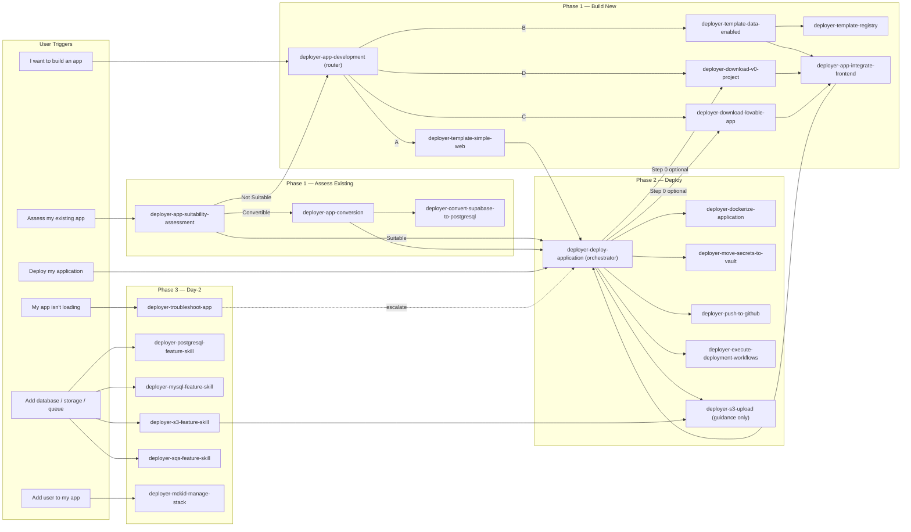

# Deployment Skills Guide

This document explains how the Cursor deployment skills work in this repository and what options are available to you. All deployment operations are orchestrated through **Cursor AI skills** synced at runtime into `.cursor/skills/deployer-skills/` and executed via **GitHub Actions workflows**.

---

## Table of Contents

- [Overview](#overview)
- [Skill Management](#skill-management)
- [Phase 1 — Build Skills](#phase-1--build-skills)
  - [1. App Development Router](#1-app-development-router)
  - [2. App Suitability Assessment](#2-app-suitability-assessment)
  - [3. App Conversion](#3-app-conversion)
  - [4. Simple Web App Template](#4-simple-web-app-template)
  - [5. Data-Enabled App Template](#5-data-enabled-app-template)
  - [6. Template Registry](#6-template-registry)
  - [7. Integrate Frontend](#7-integrate-frontend)
  - [8. Download v0 Project](#8-download-v0-project)
  - [9. Download Lovable App](#9-download-lovable-app)
  - [10. Convert Supabase to PostgreSQL](#10-convert-supabase-to-postgresql)
- [Phase 2 — Deploy Skills](#phase-2--deploy-skills)
  - [11. Deploy Application (Full Orchestration)](#11-deploy-application-full-orchestration)
  - [12. Dockerize Application](#12-dockerize-application)
  - [13. Move Secrets to Vault](#13-move-secrets-to-vault)
  - [14. Push to GitHub](#14-push-to-github)
  - [15. Execute Deployment Workflows](#15-execute-deployment-workflows)
  - [16. S3 Data Upload](#16-s3-data-upload)
  - [17. Add S3 Bucket](#17-add-s3-bucket)
  - [18. Add SQS Queue](#18-add-sqs-queue)
- [Phase 3 — Day-2 Operations](#phase-3--day-2-operations)
  - [19. Troubleshoot App](#19-troubleshoot-app)
  - [20. Add PostgreSQL Database](#20-add-postgresql-database)
  - [21. Add MySQL Database](#21-add-mysql-database)
  - [22. McKID Stack Management](#22-mckid-stack-management)
- [How It All Fits Together](#how-it-all-fits-together)
- [Important: Docker Build Requires `main` Branch](#important-docker-build-requires-main-branch)
- [Branch Protection](#branch-protection)
- [Supported Application Stacks](#supported-application-stacks)
- [Authentication & Edge Features](#authentication--edge-features)
  - [Cloudflare Access (Automatic)](#cloudflare-access-automatic)
  - [Cloudflare DNS CNAME Management](#cloudflare-dns-cname-management)
  - [Subdomain Prefix](#subdomain-prefix)
  - [Kyverno Ingress Host Restriction](#kyverno-ingress-host-restriction)
  - [McKinsey ID Integration](#mckinsey-id-integration)
  - [Managing User Access](#managing-user-access)
- [Known Issues & Gotchas](#known-issues--gotchas)
- [Quick Reference](#quick-reference)

---

## Overview

Deployment in this repository is **fully automated** through a pipeline of Cursor skills and GitHub Actions. You interact with the system by giving natural-language instructions to Cursor (e.g., "deploy my application"), and the AI orchestrates the entire process: containerizing your app, managing secrets, pushing code, building Docker images, and deploying to Kubernetes.

Skills are organized into **three phases**:

| Phase | Purpose | Entry Point |
|-------|---------|-------------|
| **Phase 1 — Build** | Scaffold or import your application | "I want to build an app" |
| **Phase 2 — Deploy** | Containerize, secure, and deploy | "Deploy application" |
| **Phase 3 — Day-2** | Troubleshoot, add features, manage access | "Troubleshoot my app" / "Add a database" |

**Key concepts:**

- **Instance** — your application, identified by a directory name under `deployer-apps/`
- **Environment** — a deployment target (e.g., `dev-us-east-1`, `stg-us-east-1`, `prod-us-east-1`)
- **GitHub Environment** — the combined identifier used by GitHub Actions: `{instance}-{env}-{region}`

---

## Skill Management

Deployer skills are **not bundled statically** in this repository. Instead, they are fetched at runtime from the [Code Beyond AI DLC](https://github.com/McK-Internal/code-beyond-ai-dlc) repository and installed under `.cursor/skills/deployer-skills/`.

### How It Works

1. The `deployer-skill-sync` rule (always-applied) checks at conversation start whether skills need to be initialized or updated
2. On first run (no `.cursor/skills/deployer-skills/.version` file), skills are synced automatically
3. On subsequent runs, a version check runs only when the conversation involves deployer skills
4. The `deployer-skill-manager` skill in `.cursor/skills/deployer-skills/deployer-skill-manager/` handles the sync using the GitHub API via the `gh` CLI

### Prerequisites

- **GitHub CLI** (`gh`) must be installed and authenticated
- Access to the `McK-Internal/code-beyond-ai-dlc` repository

### Manual Sync

To manually trigger a skill sync or update:
- Say "sync skills", "update deployer skills", or "refresh skills"

### Installed Skills Location

After sync, skills are located at `.cursor/skills/deployer-skills/<skill-name>/SKILL.md`.

---

## Phase 1 — Build Skills

> **Note:** Phase 1 skills help you scaffold a new application or assess an existing one before deployment. Start here if you are building something new or need to determine whether an existing app is compatible with the platform.

### 1. App Development Router

**Trigger phrases:** "I want to build an app", "Create new application", "Start a new project", "What kind of app should I build"

This is the **universal entry point** for building a new application. It does not scaffold code or deploy anything itself — it classifies your intent and hands off to the right skill.

**Questionnaire:**

| Option | Selection | Routes To |
|--------|-----------|-----------|
| A | Simple / static web site | [Simple Web App Template](#4-simple-web-app-template) |
| B | Dashboard over data files (Excel, CSV, PowerPoint) | [Data-Enabled App Template](#5-data-enabled-app-template) |
| C | Build my UI in Lovable | [Download Lovable App](#9-download-lovable-app) → [Integrate Frontend](#7-integrate-frontend) |
| D | Build my UI in v0 | [Download v0 Project](#8-download-v0-project) → [Integrate Frontend](#7-integrate-frontend) |
| E | Not sure / Something else | Consultation guidance |

The skill presents exactly five options via a single question — no "Other" or free-text option. If your first message already contains enough signal (e.g., "data dashboard with Excel uploads"), the skill skips the questionnaire and routes you directly.

---

### 2. App Suitability Assessment

**Trigger phrases:** "Assess my app", "Is my app deployable", "Check suitability", "Can I deploy this", "Application suitability"

A **read-only** analysis of an existing codebase. No builds, deploys, or cloud API calls are made.

**What it does:**

1. **Resolves the instance** under `deployer-apps/<instance>/src/`
2. **Scans for stack indicators** — language, framework, database, file storage, secrets, external services, and multi-service patterns
3. **Scores each dimension** against suitability criteria and produces a verdict:

| Verdict | Meaning | Next Step |
|---------|---------|-----------|
| **Suitable** | App is ready to deploy as-is | Proceed to [Deploy Application](#11-deploy-application-full-orchestration) |
| **Convertible** | App needs modifications but can be made compatible | [App Conversion](#3-app-conversion) skill |
| **Not Suitable** | App requires architectural changes beyond conversion scope | [App Development Router](#1-app-development-router) to start fresh |

**Detected signals:**

| Category | What Is Checked |
|----------|-----------------|
| Stack | Node.js (Next.js, Vite, generic), Python, Go, Rust, Ruby, .NET |
| Database | Supabase, PostgreSQL, MongoDB, SQLite, Prisma |
| File storage | AWS S3 SDK, GCS/Azure native SDKs |
| Secrets | Tracked `.env` / `.env.production` with hardcoded values |

---

### 3. App Conversion

**Trigger phrases:** "Convert my app", "Make my app compatible"

Orchestrates the appropriate conversion skills to transform an existing app into a Deployer-compatible architecture. Typically invoked automatically after a "Convertible" verdict from the suitability assessment.

This skill currently delegates to the individual conversion skills listed below. It is typically invoked automatically after a "Convertible" verdict from the suitability assessment:

| Conversion | Skill |
|------------|-------|
| Supabase → PostgreSQL | `deployer-convert-supabase-to-postgresql` |
| Frontend integration | `deployer-app-integrate-frontend` |

For multi-step or unclear conversions, contact the platform team on Slack: [#te-deployer-paas](https://mckinsey.slack.com/archives/C08DUKJDHLK).

---

### 4. Simple Web App Template

**Trigger phrases:** "Simple web app", "Static site", "Single page app", "Basic website"

Scaffolds a minimal **single-container web application** — no backend API server, no database, no data file abstractions. The result is a static or client-side-rendered app served by nginx in a single container.

**What it generates:**

- `deployer-apps/<instance>/src/package.json` — Vite + React 18 project
- `deployer-apps/<instance>/src/vite.config.ts` — with dev server on port 3000
- `deployer-apps/<instance>/src/tsconfig.json` — TypeScript config
- `deployer-apps/<instance>/src/src/App.tsx` — minimal starter component
- `deployer-apps/<instance>/src/index.html` — Vite HTML shell

After scaffolding, proceed to [Deploy Application](#11-deploy-application-full-orchestration).

---

### 5. Data-Enabled App Template

**Trigger phrases:** "Create data dashboard", "Build dashboard with data files", "Work with Excel data", "Data-enabled application"

Prepares the environment for applications that load **sensitive business data** from files (Excel, CSV, PowerPoint) and provides a clean path to local development and S3-backed production.

**Architecture:**

- `api/` — Express/FastAPI backend that reads from the storage abstraction layer
- `app/data/` — local data file root (`.gitignore`d; never committed)
- `.env.example` — documents required environment variables without storing values
- `Dockerfile` — multi-stage build for backend + frontend

**Frontend:** The template provides the backend scaffolding only. You supply your own frontend by:
1. Placing existing code in `deployer-apps/<instance>/src/ui_import/`
2. Building in Lovable and saying "download lovable app"
3. Building in v0 and saying "download v0 project"
4. Letting the skill scaffold a minimal Vite starter

After the frontend is wired in via [Integrate Frontend](#7-integrate-frontend), proceed to [Deploy Application](#11-deploy-application-full-orchestration).

**Data flow:**

```
Local dev:  app/data/*.xlsx  →  Storage abstraction  →  API  →  Frontend
Production: S3 bucket        →  Storage abstraction  →  API  →  Frontend
```

---

### 6. Template Registry

**Trigger phrases:** "List templates", "Show available templates", "Fetch template", "Get starter code"

Discovers, lists, and fetches application templates from the `McK-Internal/deployer-application-templates` GitHub repository.

**What it does:**

1. **Validates prerequisites** — `gh` CLI installed and authenticated, repository access confirmed
2. **Discovers templates** — lists all directories under `templates/` in the repo, reads `template.yaml` or README for metadata
3. **Presents a numbered list** — name, description, language/framework, tags
4. **Fetches the selected template** — downloads and extracts into `deployer-apps/<instance>/src/`

This skill is also called **automatically** by [Data-Enabled App Template](#5-data-enabled-app-template) to pull the `data-enabled` backend scaffold.

**Requires:** `gh` CLI authenticated with access to `McK-Internal/deployer-application-templates`.

---

### 7. Integrate Frontend

**Trigger phrases:** "Import my frontend", "Add my frontend", "Integrate my frontend", "Plug in my UI", "Connect my frontend"

Wires a user-provided frontend application into the Deployer data-enabled backend template. The user's only job is to copy their app folder to `deployer-apps/<instance>/src/ui_import/` — this skill handles the rest.

**Prerequisites:**

- Backend template already scaffolded at `deployer-apps/<instance>/src/`
- Frontend code present at `deployer-apps/<instance>/src/ui_import/`

**What it does:**

1. **Validates** the `ui_import/` directory exists and flattens any wrapper folder
2. **Detects the framework** from `package.json` dependencies

| Framework | Detection Signal | Build Command | Output Dir |
|-----------|-----------------|---------------|------------|
| Next.js | `next` in deps | `next build` | `.next/` or `out/` |
| React + Vite | `vite` in devDeps + `react` | `vite build` | `dist/` |
| Vue + Vite | `vite` in devDeps + `vue` | `vite build` | `dist/` |
| Svelte + Vite | `vite` in devDeps + `svelte` | `vite build` | `dist/` |
| Create React App | `react-scripts` | `react-scripts build` | `build/` |
| Static HTML | `index.html` (no package.json) | None | `ui_import/` |

3. **Merges dependencies** from `ui_import/package.json` into the backend `package.json`
4. **Configures the dev proxy** so `/api` routes reach the backend during local development
5. **Updates the Dockerfile** to add a frontend build stage

---

### 8. Download v0 Project

**Trigger phrases:** "Download v0 project", "Pull v0 project", "Import from v0"

Downloads a v0.dev project into the `deployer-apps/<instance>/src/` directory via the Vercel deployment API.

**What it does:**

1. **Accepts flexible input** — v0 chat ID, v0 chat URL (`https://v0.app/chat/...`), or a published Vercel deployment URL (`https://*.vercel.app`)
2. **Authenticates via API token** — reads the user's Vercel or v0 API token securely from the clipboard (never displayed in chat)
3. **Resolves the deployment** — if given a chat ID, searches the user's Vercel projects and deployments to find the matching deployment
4. **Downloads all source files** — retrieves the file tree from the Vercel deployment API and downloads each file (handling JSON+base64 encoding)
5. **Fixes binary files** — double-decodes binary assets (images, fonts, SVGs) that are double base64-encoded by the API
6. **Cleans up** — removes nested `.git` directory and temporary files

**Accepted inputs:**

| Input | Example |
|-------|---------|
| v0 chat ID | `dark-green-colors-jy0YIK3AEiJ` |
| v0 chat URL | `https://v0.app/chat/dark-green-colors-jy0YIK3AEiJ` |
| Vercel deployment URL | `https://my-app-zeta.vercel.app` |

**API token options:**

| Token Type | Where to Generate |
|------------|-------------------|
| Vercel API Token (recommended) | [vercel.com/account/settings/tokens](https://vercel.com/account/settings/tokens) |
| v0 API Token | [v0.app/chat/settings/keys](https://v0.app/chat/settings/keys) |

**Fallback:** If the API method fails, the skill guides you through manually downloading a ZIP from v0.dev.

> **Note:** v0 projects are typically Next.js with React, Tailwind CSS, and shadcn/ui.

---

### 9. Download Lovable App

**Trigger phrases:** "Download lovable app", "Download lovable project", "Import lovable app", "Import from lovable"

Downloads a Lovable-exported application into the project and automatically detects whether database conversion is needed.

**What it does:**

1. **Guides ZIP export** — instructs you to export your app as a ZIP from the Lovable UI
2. **Opens a file picker** — uses a native macOS file dialog to select the downloaded ZIP
3. **Extracts and flattens** — unzips into `deployer-apps/<instance>/app/`, handling wrapper folders that Lovable often creates
4. **Scans for database code** — searches the extracted source for Supabase, Prisma, Drizzle, or other database client usage
5. **Triggers database conversion** — if Supabase or other database code is detected, automatically invokes the [Convert Supabase to PostgreSQL](#10-convert-supabase-to-postgresql) skill

> **Note:** Lovable apps are typically React + Vite + TypeScript applications. Most Lovable apps that use data persistence will use Supabase.

---

### 10. Convert Supabase to PostgreSQL

**Trigger phrases:** "Convert supabase to postgresql", "Convert to postgres", "Migrate database", "Switch to RDS"

Converts an application's database layer from Supabase (or other databases) to PostgreSQL 16.8 running on the Deployer K8s PaaS shared RDS cluster.

**What it does:**

1. **Discovers current database usage** — scans for Supabase, SQLite, DynamoDB, Prisma, or other database client code
2. **Generates PostgreSQL schema** — converts schemas to PostgreSQL 16.8-compatible DDL, removing Supabase-specific features (RLS policies, `auth.role()`)
3. **Replaces database client code** — swaps the old client (e.g., `@supabase/supabase-js`) with a standard `pg` driver (Node.js) or `psycopg2` (Python)
4. **Adds backend API layer** — for frontend-only apps that used Supabase client-side, creates an Express/FastAPI backend that proxies database queries
5. **Configures Terraform** — adds `postgresql_databases` block to `main.tf` for RDS provisioning
6. **Wires Helm values** — configures `values.yaml` with ConfigMap and Secret references for database connection details (`RDS_DB_*` env vars)

**Database connection environment variables:**

| Variable | Source |
|----------|--------|
| `RDS_DB_NAME` | ConfigMap |
| `RDS_DB_OWNER` | ConfigMap |
| `RDS_DB_WRITER_ENDPOINT` | ConfigMap |
| `RDS_DB_READER_ENDPOINT` | ConfigMap |
| `RDS_DB_PASSWORD` | Secret |

**Limitations:**
- Max 5 PostgreSQL databases per namespace/instance
- Databases run on a shared RDS cluster (PostgreSQL 16.8)
- Only `us-east-1` region supported

---

## Phase 2 — Deploy Skills

> **Note:** The skills listed below are fetched at runtime by the `deployer-skill-manager` and are not bundled statically in this repository. They are installed under `.cursor/skills/deployer-skills/` after the first sync.

### 11. Deploy Application (Full Orchestration)

**Trigger phrases:** "Deploy application", "Deploy", "Deploy v0 application", "Deploy v0 project", "Deploy lovable application", "Deploy lovable project"

This is the **master deploy skill** that chains all other Phase 2 skills together in the correct order.

**Security guardrails:** The deploy skill enforces strict security controls. If the Wiz vulnerability scan fails, the workflow **stops** — it will never edit CI configuration to bypass scans or re-run with weakened policies.

| Vulnerability Source | Recommended Action |
|---|---|
| **Base image OS packages** | Upgrade the base image to the latest patch version; consider distroless or minimal base images |
| **Application dependencies** | Update the affected dependency to a patched version (`npm audit fix` or equivalent) |
| **Dockerfile configuration** | Fix the Dockerfile (non-root user, minimal permissions, no secrets in layers) |
| **False positives or accepted risks** | The user must obtain a security waiver through proper channels — the workflow never bypasses the scan |

It walks you through the entire deployment lifecycle:

| Step | What Happens | Interactive? |
|------|-------------|--------------|
| 0. Source Acquisition (Conditional) | Downloads source from v0.dev or Lovable if mentioned in the request | Yes — token/URL required for v0; ZIP file for Lovable |
| 1. Discover Instance & Environment | Identifies which app and environment to deploy; validates the GitHub environment exists | Yes — you choose the environment if there are multiple |
| 2. Cloudflare Access Authentication | Verifies that Cloudflare Access resources were provisioned during instance creation | Automatic — no user action required |
| 3. Branch Protection Check | Ensures you're not modifying code on `main` | Yes — you can create a new branch or continue |
| 4. Move Secrets to Vault | Scans for hardcoded secrets and moves them to HashiCorp Vault | Yes — you confirm each secret |
| 5. Configure Database Migrations (Conditional) | Sets up automated schema migrations if `db/migrations/` exists | Automatic with summary |
| 6. Dockerize Application | Creates production Dockerfile(s), `.dockerignore`, and CI workflow | Yes — you approve generated files |
| 7. Validate Helm Values | Ensures `values.yaml` has all required Kubernetes configuration | Automatic with summary |
| 8. Push & Merge to `main` | Commits and pushes to the current branch | Automatic |
| 9. Execute Deployment Workflows | Builds Docker image, creates PR to main, waits for merge, then deploys | Yes — you merge the PR |
| 10. S3 Data Upload (Conditional) | Guides data file upload to S3 via Platform McKinsey for data-enabled applications | Yes — user uploads via S3 console |

> **Note:** Cloudflare Access (McKinsey ID SSO) and DNS CNAME records are configured **automatically** by the control plane during instance creation. There is no manual authentication setup step in the deployment flow.

**Allowed `cloudflareZone` values:**

| Zone | Environment |
|------|-------------|
| `sbx.apps.mckinsey.com` | Sandbox |
| `npn.apps.mckinsey.com` | Non-production |
| `apps.mckinsey.com` | Production |

**What it produces:**
- Production-ready `Dockerfile`(s) (main app, migrations, additional services)
- A `.dockerignore` file
- A GitHub Actions CI workflow for building/scanning/pushing all Docker images to JFrog
- Updated `values.yaml` with correct Helm configuration (including `subdomainPrefix` and pinned image tags)
- Secrets written to HashiCorp Vault
- Database migration infrastructure (if applicable)
- A running deployment on Kubernetes

---

### 12. Dockerize Application

**Trigger phrases:** "Dockerize application", "Dockerize my application", "Containerize my app"

Creates a production-ready Docker setup for your application. Can be run independently of the full deploy flow.

**What it does:**

1. **Auto-detects your tech stack** by inspecting files in `deployer-apps/<instance>/src/`
2. **Validates and fixes dependencies** — scans source code imports and ensures every third-party package is declared in the dependency manifest (`requirements.txt`, `package.json`, or `go.mod`)
3. **Generates Dockerfile(s)** with:
   - Multi-stage builds (builder + production stages)
   - Pinned base image versions
   - Non-root user for security
   - Health check endpoint
   - Optimized layer caching
   - BuildKit cache mounts
4. **Creates a `.dockerignore`** tailored to your stack (created or overwritten automatically without user confirmation)
5. **Discovers all Dockerfiles** in the `src/` directory (including `Dockerfile.migrations`, `Dockerfile.<service>`, etc.) and generates a single CI workflow that builds all of them
6. **Generates a GitHub Actions CI workflow** (`<instance>-lrah-docker-build-and-publish.yml`) that:
   - Detects the package manager (npm/yarn for Node.js)
   - Installs dependencies
   - Runs unit tests (if present)
   - Generates semver version tags
   - Builds **all** discovered Docker images
   - Scans each for vulnerabilities with JFrog Xray
   - Pushes to JFrog with versioned tags

**Supported stacks:**

| Stack | Detection | Default Port |
|-------|-----------|--------------|
| Node.js (Next.js) | `package.json` + `next.config.*` | 3000 |
| Node.js (React/Vite) | `package.json` + `vite.config.*` | 3000 |
| Node.js (React/Vite) + Python | `package.json` + `vite.config.*` + `requirements.txt` | 3000 |
| Node.js (generic) | `package.json` | 3000 |
| Python (FastAPI/Flask) | `requirements.txt` or `pyproject.toml` | 8000 |
| Go | `go.mod` | 8080 |

**Multi-Dockerfile support:**

| Dockerfile | Image Name |
|------------|------------|
| `Dockerfile` | `<instance>-app` |
| `Dockerfile.migrations` | `<instance>-migrations` |
| `Dockerfile.<suffix>` | `<instance>-<suffix>` |

**Output files:**
- `deployer-apps/<instance>/src/Dockerfile` (and any additional `Dockerfile.*` files)
- `deployer-apps/<instance>/src/.dockerignore`
- `.github/workflows/<instance>-lrah-docker-build-and-publish.yml`

---

### 13. Move Secrets to Vault

**Trigger phrases:** "Move sensitive variables into secrets", "Parameterize secrets", "Move secrets to vault"

Extracts hardcoded secrets from your code and configures them to be injected at runtime via HashiCorp Vault.

**What it does:**

1. **Scans your codebase** for hardcoded secrets — API keys, tokens, passwords, credentials, high-entropy strings, URLs with embedded credentials, JWT tokens, and secrets in Terraform/Dockerfiles
2. **Replaces hardcoded values** with environment variable references:
   - Python: `os.getenv('API_KEY')`
   - Node.js: `process.env.API_KEY`
3. **Configures Kubernetes ExternalSecrets** in `values.yaml` (`vaultSecrets` block) to pull from Vault
4. **Updates the deployment template** to inject secrets as environment variables
5. **Writes secret values to HashiCorp Vault** via a GitHub Actions workflow

**Multi-environment support:** When multiple environments are detected (e.g., `dev-us-east-1`, `stg-us-east-1`), the skill presents an interactive menu:

| Option | Description |
|--------|-------------|
| **All environments** | Apply the same secrets JSON to every environment |
| **Select specific** | Choose which environments to target |
| **One at a time** | Interactive mode for environment-specific secret values |

**Secret flow:**
```
HashiCorp Vault → ExternalSecret → K8s Secret → Env Var → Your Application
```

**Important:** Frontend secrets must never use build-time env vars. The skill enforces runtime injection via the backend API.

---

### 14. Push to GitHub

**Trigger phrases:** "Push changes to GitHub", "Commit and push", "Push my work"

Commits all staged changes using **Conventional Commits** format and pushes to the current branch.

**Commit types available:**

| Type | Use When |
|------|----------|
| `feat` | Adding a new feature |
| `fix` | Fixing a bug |
| `docs` | Documentation changes only |
| `style` | Formatting, no code change |
| `refactor` | Restructuring code |
| `test` | Adding or updating tests |
| `chore` | Maintenance tasks |
| `perf` | Performance improvements |
| `ci` | CI/CD pipeline changes |
| `build` | Build system changes |

The skill automatically analyzes your staged changes to determine the appropriate commit type and writes a descriptive commit message.

---

### 15. Execute Deployment Workflows

**Trigger phrases:** "Execute deployment action", "Run deployment workflows", "Trigger deploy"

Triggers the Docker build on the current branch, creates a pull request to `main`, waits for the user to merge it, then triggers the Kubernetes deployment workflow on `main`.

| Step | Action | Branch | Purpose |
|------|--------|--------|---------|
| 1 | Trigger Docker build | Current branch | Build & scan Docker image(s) |
| 2 | Wait for build to complete | Current branch | Verify CI passes |
| 3 | Update `values.yaml` image tag | Current branch | Pin image to the exact semver+hash from the build (e.g., `0.1.0-fee4554a`) |
| 4 | Create PR to `main` | Current → main | Merge changes (including pinned tag) into main |
| 5 | Wait for user to merge PR | — | User reviews and merges in GitHub |
| 6 | Trigger Kubernetes deployment | `main` | Deploy to Kubernetes via ArgoCD (with `-f prune_resources=no`) |
| 7 | Monitor and report | `main` | Watch until deployment completes |

The Kubernetes deployment workflow is triggered with `-f prune_resources=no` to prevent accidental removal of existing resources during deploy.

Both workflows can also be triggered manually from the GitHub Actions UI via `workflow_dispatch`.

> **Important:** The deployment platform only deploys code from the `main` branch, so the PR-merge step is required. See [Docker Build Requires `main` Branch](#important-docker-build-requires-main-branch) for details.

---

### 16. S3 Data Upload

**Trigger phrases:** "Upload data to S3", "Sync data files", "Push data to production"

A **guidance-only** skill that walks you through uploading data files to your provisioned S3 bucket via the **AWS S3 console in Platform McKinsey**. Used exclusively for **data-enabled applications** where business data (Excel, CSV) must be available in S3 for the production app to read. This skill does not upload files automatically.

**What it does:**

1. **Resolves platform context** — instance, bucket name (`<account-id>-<env-id>-<bucket-name>`), and key prefix from `values.yaml` and platform steering
2. **Discovers data files** under `deployer-apps/<instance>/src/app/data/` by scanning for supported extensions (`.xlsx`, `.csv`, `.xlsm`, `.xls`, `.parquet`, `.json`, `.pptx`)
3. **Validates `.gitignore`** — halts immediately if any data file is not ignored by git
4. **Provides upload instructions** — maps local paths to S3 prefixes and directs you to the AWS S3 console in Platform McKinsey

**S3 folder structure:**

| S3 Prefix | What to Upload | Local Source |
|-----------|---------------|--------------|
| `data/` | Workbook and tabular data files (`.xlsx`, `.csv`, `.json`, `.parquet`, etc.) | `deployer-apps/<instance>/src/app/data/` |
| `images/` | Image assets referenced by application data | `deployer-apps/<instance>/src/app/data/images/` (if present) |

5. **Verifies configuration** — checks that `STORAGE_TYPE`, `BUCKET_NAME`, `APP_DATA_FILE_KEY`, and `AWS_REGION` are correctly set in `values.yaml`

**Requires:** A bucket must already be provisioned via [Add S3 Bucket](#17-add-s3-bucket).

---

### 17. Add S3 Bucket

**Trigger phrases:** "Add S3", "Create bucket", "Use object storage", "Store files in S3", "S3 access", "Upload files", "Download files"

Guides you through provisioning an AWS S3 bucket via the LRAH Terraform module and configuring IRSA (IAM Roles for Service Accounts) access.

**What it does:**

1. **Resolves platform context** — account ID, environment ID, and region from `values.yaml`
2. **Clarifies intent** — asks what the bucket will store and whether the app needs read-only, write-only, or read-write access
3. **Validates the bucket name** — enforces naming conventions (`{account-id}-{env-id}-{name}`, lowercase, 3–63 chars)
4. **Updates `main.tf`** — adds an `s3_buckets` block in the user configuration section
5. **Updates `values.yaml`** — adds the IAM role ARN annotation and bucket env vars
6. **Provides SDK examples** — shows Node.js or Python code to connect using IRSA credentials

**IAM role naming:**

| Access Pattern | Role Suffix | Full Role Name |
|----------------|-------------|----------------|
| Read-write or write-only | `ReadWrite` | `S3-{account-id}-{env-id}-{name}-ReadWrite` |
| Read-only | `Read` | `S3-{account-id}-{env-id}-{name}-Read` |

After provisioning, run "Deploy infra" from the GitHub Actions UI to apply the Terraform changes.

---

### 18. Add SQS Queue

**Trigger phrases:** "Add SQS", "Create queue", "Use message queue", "Send messages", "SQS access", "Event-driven", "Pub/sub"

Guides you through provisioning an AWS SQS queue via the LRAH Terraform module and configuring IRSA access.

**What it does:**

1. **Resolves platform context** — account ID, environment ID, and region from `values.yaml`
2. **Clarifies intent** — asks what the queue is for and whether the app is a producer, consumer, or both
3. **Validates the queue name** — enforces naming conventions (`{account-id}-{env-id}-{name}`, valid characters, max 80 chars; FIFO queues must end in `.fifo`)
4. **Updates `main.tf`** — adds an `sqs_queues` block in the user configuration section
5. **Updates `values.yaml`** — adds the IAM role ARN annotation and queue URL env vars
6. **Provides SDK examples** — shows Node.js or Python code to send and receive messages

**Message patterns supported:**

| Pattern | Description |
|---------|-------------|
| Producer-only | Application only sends messages |
| Consumer-only | Application only receives messages |
| Producer-consumer | Application both sends and receives |

After provisioning, run "Deploy infra" from the GitHub Actions UI to apply the Terraform changes.

---

## Phase 3 — Day-2 Operations

> Phase 3 skills handle post-deployment concerns: troubleshooting, adding infrastructure features, and managing user access.

### 19. Troubleshoot App

**Trigger phrases:** "My app isn't loading", "Deployment failed", "I can't access my app", "My app keeps restarting", "Something is wrong with my app", "The deployment worked but my app is down", "Help me fix my deployment", "Troubleshoot", "Why is my app not working", "I see a 503 error", "Access denied", "Blank page"

Diagnoses deployment and application issues by understanding every layer in the request path — from Cloudflare edge to the application pod. Translates infrastructure errors into plain language with actionable next steps. Requires only the `gh` CLI — no `kubectl`, Docker, or Vault needed.

**Request path understood:**

```
User's Browser
    │
    ▼
Cloudflare DNS (proxied CNAME → AWS NLB hostname)
    │
    ▼
Cloudflare Access (Zero Trust gateway)
    ├─ Redirects unauthenticated users to McKinsey ID login
    ├─ Validates OIDC token against Access Policy
    └─ Policy checks membership in {instance}-users McKID group
    │
    ▼
AWS Network Load Balancer (NLB)
    │
    ▼
nginx-ingress controller (shared, routes by Host header)
    ├─ Matches: {subdomainPrefix}.{cloudflareZone}
    └─ Routes to ClusterIP Service in instance namespace
    │
    ▼
Kubernetes Service (ClusterIP) → Pod(s)
```

**Symptom routing:**

| What the user sees | Likely layer | Action |
|---|---|---|
| Cloudflare error page, "Access denied", ray ID | Cloudflare Access or edge | Checks Access policy and McKID group membership |
| McKinsey login redirect loop | McKID / Cloudflare Access policy | Validates OIDC configuration |
| "503 Service Temporarily Unavailable" (nginx) | nginx-ingress → no healthy backend | Checks pod health and ingress configuration |
| "502 Bad Gateway" | nginx-ingress → backend unreachable | Checks service and pod connectivity |
| 404 or blank page | App routing or ingress misconfigured | Validates ingress host, Helm values |
| App loads but crashes | Application code issue | Reads pod logs via GitHub Actions workflow |
| "The deployment worked but my app is down" | Pod-level failure (CrashLoopBackOff etc.) | Full cluster diagnostic sweep |

**Error translation:** The skill translates infrastructure errors into plain-language explanations. It never exposes raw Kubernetes terms, pod names, or status codes to the user in the primary response.

| Infrastructure Pattern | What the User Is Told | Resolution |
|---|---|---|
| No pods / no deployments found | "Your application's deployment was removed from the cluster." | Check build/deploy history; redeploy if image exists |
| CrashLoopBackOff | "Your application is crashing on startup and keeps restarting." | Logs + deep-dive (see below) |
| ImagePullBackOff / ErrImagePull | "Your application's build image could not be found." | Check recent Docker build |
| OOMKilled | "Your application ran out of memory and was stopped." | Adjust memory limits in `values.yaml` |
| Pending (unschedulable) | "Your application is waiting to start but no space is available." | Escalate to platform team |
| CreateContainerConfigError | "A required configuration (secret or configmap) is missing." | Check secrets and config |
| ImagePullBackOff (401/403) | "Permission issue downloading the application image." | Escalate to platform team |
| Ingress misconfigured / Kyverno violation | "Your application is running but can't be reached at its URL." | Fix subdomain/routing in `values.yaml` |

**CrashLoopBackOff deep-dive:**

| Log Pattern | Diagnosis | Next Step |
|---|---|---|
| Connection refused / timeout to database host | App can't connect to its database | Check database provisioning and secrets |
| `MODULE_NOT_FOUND` or import errors | Missing a required library | Fix Dockerfile and dependency manifest |
| `EADDRINUSE` / port already in use | Port conflict | Check container port in `values.yaml` |
| `ENOENT` / file not found | Missing file in container | Check Dockerfile COPY/ADD |
| Exit code 137 | Out of memory | Increase memory limits in `values.yaml` |
| Exit code 1 with no clear error | Startup crash | Check startup code locally |
| No logs at all | Container couldn't start (broken image) | Rebuild via [Execute Deployment Workflows](#15-execute-deployment-workflows) |

If the root cause requires a redeployment, this skill escalates to [Deploy Application](#11-deploy-application-full-orchestration).

---

### 20. Add PostgreSQL Database

**Trigger phrases:** "PostgreSQL", "Postgres", "Add database", "Create database", "PG database", "RDS database", "Connect to postgres", "Use postgres"

Guides you through provisioning a PostgreSQL database via the LRAH Terraform module and configuring either IRSA (passwordless) or password authentication.

**What it does:**

1. **Resolves platform context** — account ID, environment ID, and region
2. **Clarifies intent** — purpose of the database, authentication mode, and application runtime
3. **Validates the database name** — lowercase alphanumeric and hyphens, no leading/trailing hyphens; shows an advisory warning when 4 or more databases already exist (max 5 per namespace)
4. **Updates `main.tf`** — adds a `postgresql_databases` block
5. **Updates `values.yaml`** — wires ConfigMap and Secret references for connection details
6. **Provides SDK examples** — Node.js or Python connection code

**Authentication modes:**

| Mode | Description | Terraform Flag |
|------|-------------|----------------|
| **IRSA (default, recommended)** | Passwordless IAM-based auth via short-lived token | `generate_password = false` in `roles` block |
| **Password (explicit opt-in)** | Static credentials stored in a Kubernetes Secret | `generate_password = true` in `roles` block |

**Database connection environment variables:**

| Variable | Source |
|----------|--------|
| `RDS_PG_NAME` | ConfigMap |
| `RDS_PG_OWNER` | ConfigMap |
| `RDS_PG_WRITER_ENDPOINT` | ConfigMap |
| `RDS_PG_READER_ENDPOINT` | ConfigMap |
| `RDS_PG_PASSWORD` | Secret (password mode only) |

**Limitations:**
- Max 5 PostgreSQL databases per namespace/instance
- Databases run on a shared RDS cluster (PostgreSQL 16.8)
- Only `us-east-1` region supported

After provisioning, run "Deploy infra" from the GitHub Actions UI to apply the Terraform changes.

---

### 21. Add MySQL Database

**Trigger phrases:** "MySQL", "Add MySQL", "Create MySQL", "MySQL database", "RDS MySQL", "Connect to MySQL", "Use MySQL"

Guides you through provisioning a MySQL database via the LRAH Terraform module and configuring IRSA or password authentication. Follows the same 9-step workflow as the PostgreSQL skill.

**What it does:**

1. **Resolves platform context** — account ID, environment ID, and region
2. **Clarifies intent** — purpose, authentication mode (`iam_authentication` in the `owner` block), and application runtime
3. **Validates the database name and owner name** — same naming rules as PostgreSQL
4. **Updates `main.tf`** — adds a MySQL database block
5. **Updates `values.yaml`** — wires ConfigMap and Secret references for connection details
6. **Provides SDK examples** — Node.js or Python connection code

**Key difference from PostgreSQL:** MySQL uses an `owner` block with `iam_authentication = true/false` instead of a `roles` block with `generate_password`. There is no separate `roles` block.

**Required environment variables:**

In addition to the database connection variables (host, name, user, password), MySQL requires two additional static environment variables in `values.yaml`:

| Variable | IRSA Value | Password Value | Purpose |
|----------|-----------|----------------|---------|
| `MYSQL_AUTH_MODE` | `iam` | `password` | Tells the application which authentication mechanism to use |
| `MYSQL_TLS_MODE` | `skip-verify` | `skip-verify` | TLS verification mode for the RDS connection |

> **Recommended TLS configuration:** Install the [AWS RDS CA certificate bundle](https://docs.aws.amazon.com/AmazonRDS/latest/UserGuide/UsingWithRDS.SSL.html) in your container image and set `MYSQL_TLS_MODE` to `verify-ca`. This preserves TLS encryption **and** validates the server certificate.
>
> **Current default (`skip-verify`):** Alpine and distroless container images do not include the AWS RDS CA certificate bundle. With `skip-verify`, the connection is still encrypted (TLS) but the client does not verify the server's certificate against a CA, which leaves MITM attacks possible. Use `skip-verify` only when the CA bundle cannot yet be installed, and only with explicit risk acceptance.

After provisioning, run "Deploy infra" from the GitHub Actions UI to apply the Terraform changes.

---

### 22. McKID Stack Management

**Trigger phrases:** "Configure auth", "Manage McKID stack", "Add users to my app", "Add user to my application", "Get dashboard URL"

Manages the McKinsey ID (McKID) authentication stack provisioned for your application. All operations run via the `*-LRAH manage McKID stack` GitHub Actions workflow.

**Available operations:**

| Operation | Description | Key Parameters | Batch Support |
|-----------|-------------|----------------|---------------|
| `grant-app-access` | Add user(s) as stack members and to the app access group in a single run | `member_email`, `group_name` | Yes |
| `revoke-app-access` | Remove user(s) from the app access group | `member_email`, `group_name` | Yes |
| `list-stack-details` | View all assets, groups, and members | None | — |
| `update-asset-redirect-uris` | Set OAuth callback URLs and CORS origins | `redirect_uris`, `cors_origins` (optional) | — |
| `create-pkce-asset` | Create an additional OIDC PKCE client | `asset_name` | — |
| `add-stack-member` | Add user(s) to the stack (dashboard visibility only) | `member_email` | Yes |
| `remove-stack-member` | Remove user(s) from the stack entirely | `member_email` | Yes |
| `add-group-member` | Add user(s) to a group (also adds as stack member automatically) | `member_email`, `group_name` | Yes |
| `remove-group-member` | Remove user(s) from a group | `member_email`, `group_name` | Yes |

**Batch operations:** All email-based operations accept multiple comma-separated emails in a single workflow run (e.g., `jane@mckinsey.com,john@mckinsey.com`).

**McKID resources provisioned for your app:**

| Resource | GitHub Variable | Purpose |
|----------|----------------|---------|
| Stack ID | `MCKID_STACK_ID` | Unique stack identifier (UUID) |
| OIDC Client ID | `MCKID_CLIENT_ID` | PKCE asset client_id for your app |
| OIDC Discovery URL | `MCKID_PROVIDER_CONFIG_URL` | OIDC discovery endpoint |
| Users Group Name | `MCKID_GROUP_NAME` | Access group for application users |
| API URL | `MCKID_API_URL` | McKID GraphQL API endpoint |
| Auth Protocol URL | `MCKID_AUTH_PROTOCOL_URL` | Auth realm protocol URL (used by workflow for token exchange) |

**McKID dashboard URL:** Stack owners can access the dashboard directly at `https://dashboard.mckinsey.id/stack-detail/{STACK_ID}/`. Ask "Get my McKID dashboard URL" to have the skill construct the full link.

---

## How It All Fits Together

Skills are organized into three phases that take you from zero to a running application and beyond.

### High-level overview

Three phases, progressing left to right through the application lifecycle:

```mermaid
flowchart LR
    subgraph TRIGGERS["User Triggers"]
        U_BUILD["I want to build an app"]
        U_ASSESS["Assess my existing app"]
        U_DEPLOY["Deploy my application"]
        U_TROUBLE["My app isn't loading"]
        U_USERS["Add user to my app"]
        U_DAY2["Add database / storage / queue"]
    end

    subgraph PHASE1["Phase 1 — Build"]
        APP_DEV["deployer-app-development (router)"]
        SIMPLE["deployer-template-simple-web"]
        DATA["deployer-template-data-enabled"]
        REGISTRY["deployer-template-registry"]
        DL_V0["deployer-download-v0-project"]
        DL_LOV["deployer-download-lovable-app"]
        INTEGRATE["deployer-app-integrate-frontend"]
        ASSESS["deployer-app-suitability-assessment"]
        CONVERT["deployer-app-conversion"]
        CONV_DB["deployer-convert-supabase-to-postgresql"]
    end

    subgraph PHASE2["Phase 2 — Deploy"]
        DEPLOY["deployer-deploy-application (orchestrator)"]
        DOCKER["deployer-dockerize-application"]
        SECRETS["deployer-move-secrets-to-vault"]
        PUSH["deployer-push-to-github"]
        WORKFLOWS["deployer-execute-deployment-workflows"]
        S3UP["deployer-s3-upload (guidance only)"]
    end

    subgraph PHASE3["Phase 3 — Day-2"]
        TROUBLE["deployer-troubleshoot-app"]
        PG["deployer-postgresql-feature-skill"]
        MYSQL["deployer-mysql-feature-skill"]
        S3["deployer-s3-feature-skill"]
        SQS["deployer-sqs-feature-skill"]
        MCKID["deployer-mckid-manage-stack"]
    end

    U_BUILD --> PHASE1
    U_ASSESS --> PHASE1
    U_DEPLOY --> PHASE2
    U_TROUBLE --> PHASE3
    U_USERS --> PHASE3
    U_DAY2 --> PHASE3

    PHASE1 --> PHASE2
    PHASE2 -.->|"escalate"| PHASE3
    PHASE3 -.->|"re-deploy"| PHASE2
```



### Detailed skill routing

Full dependency map showing how individual skills chain together, including assessment verdict paths, the deploy orchestrator's optional download steps, and Day-2 escalation:



Each skill can also be invoked **independently** by using its trigger phrase. For example, you can just say "Dockerize my application" without running the full deployment, or "Add a database" at any point after your app is deployed.

---

## Important: Docker Build Requires `main` Branch

The Docker build and publish workflow authenticates to JFrog using **OIDC token exchange**. The JFrog identity mapping is configured to **only trust tokens from the `main` branch**. This means:

- Docker builds triggered from feature branches will fail with `403 Forbidden` at the JFrog CLI setup step.
- You **must merge your changes to `main`** before the Docker build workflow can succeed.
- The CI workflow will auto-trigger on push to `main` when files in `deployer-apps/<instance>/src/**` change.
- You can also manually trigger it from `main` via `workflow_dispatch` in the GitHub Actions UI.

> **CRITICAL — Per-Instance Values:** The `OIDC Provider` name and `Docker Registry` URL shown below are **per-instance** and differ for every deployed application. Never copy these values from another instance's workflow. Look up the correct values from the instance's `values.yaml` (label `app.kubernetes.io/lrah-user-product-id` for the product ID, `image.repository` for the JFrog repo) or from the existing rendered Docker build workflow.

**JFrog configuration:**

| Setting | Value |
|---------|-------|
| JFrog URL | `https://mckinsey.jfrog.io` |
| OIDC Provider | `svc-<PRODUCT_ID>-rw` (per-instance; product ID is in `values.yaml` label `app.kubernetes.io/lrah-user-product-id`) |
| OIDC Audience | `rw` |
| Docker Registry | `mckinsey-<instance>-docker-local.jfrog.io` |
| Image Name | `<instance>-app` (main), `<instance>-migrations` (migrations), `<instance>-<suffix>` (others) |

---

## Branch Protection

Code-modifying skills enforce branch protection:

| Skill | Modifies Code? | Branch Check? |
|-------|---------------|---------------|
| Deploy Application | Yes | Yes |
| Dockerize Application | Yes | Yes |
| Move Secrets to Vault | Yes | Yes |
| App Suitability Assessment | No (read-only) | No |
| Simple Web App Template | Yes | No |
| Data-Enabled App Template | Yes | No |
| Integrate Frontend | Yes | No |
| Push to GitHub | No (only commits) | No |
| Execute Deployment Workflows | No (only triggers) | No |
| Add S3 Bucket | Yes (Terraform + Helm) | No |
| Add SQS Queue | Yes (Terraform + Helm) | No |
| Add PostgreSQL Database | Yes (Terraform + Helm) | No |
| Add MySQL Database | Yes (Terraform + Helm) | No |
| S3 Data Upload | No (guidance only) | No |
| Troubleshoot App | No (read-only) | No |
| McKID Stack Management | No (only triggers workflows) | No |

If you are on `main`/`master`, the skill will warn you and offer to create a deployment branch. Branches follow **conventional commit-style naming**:

```
<type>/<instance>-<short-description>
```

| Type | When to Use | Example |
|------|-------------|---------|
| `deploy` | Initial or full deployment | `deploy/cz-pilot-6-initial-deploy` |
| `feat` | Adding a new feature | `feat/cz-pilot-6-add-mckid-auth` |
| `fix` | Bug fixes | `fix/cz-pilot-6-helm-values` |
| `chore` | Maintenance tasks | `chore/cz-pilot-6-vault-secrets` |
| `ci` | CI/CD changes only | `ci/cz-pilot-6-update-docker-build` |
| `refactor` | Restructuring without functional change | `refactor/cz-pilot-6-config` |

---

## Supported Application Stacks

The Dockerize skill auto-detects your stack and tailors all generated artifacts accordingly:

| Stack | Dockerfile Pattern | CI Workflow Extras | Test Detection |
|-------|-------------------|-------------------|----------------|
| **Node.js (Next.js)** | `node:20-alpine`, standalone output | npm/yarn detection, `setup-node` | `test:ci` in `package.json` |
| **Node.js (React/Vite)** | `node:20-alpine` (builder) → `nginx:1.27-alpine` (production) | npm/yarn detection, `setup-node` | `test:ci` in `package.json` |
| **Node.js (React/Vite) + Python** | `node:20-alpine` (UI builder) → `python:3.12-slim` (production) | npm/yarn + pip setup | `test:ci` or `pytest` |
| **Python** | `python:3.12-slim`, user install | `setup-python`, pip cache | `tests/` directory + pytest |
| **Go** | `golang:1.21-alpine` + distroless | Go module cache | Go test |

All generated Dockerfiles include: multi-stage builds, non-root users, health checks, BuildKit cache mounts, and optimized layer ordering.

---

## Authentication & Edge Features

Authentication and edge networking are handled automatically by the control plane during instance creation. Three systems work together: **McKinsey ID (McKID)** provides the identity provider (OIDC), **Cloudflare Access** acts as the gateway that protects your application's URL, and **Cloudflare DNS** manages the CNAME record that routes traffic to your cluster. Together they ensure only **explicitly authorized users** can reach your app — access is not open to all McKinsey employees by default.

### How the Pieces Fit Together

```
User visits your app URL
        │
        ▼
┌──────────────────┐     ┌──────────────────┐     ┌──────────────┐
│ Cloudflare DNS   │     │ Cloudflare Access │     │              │
│ (CNAME → cluster)│────►│  (gateway/proxy)  │────►│   Your App   │
└──────────────────┘     └──────────────────┘     │ (Kubernetes) │
                                │                  └──────────────┘
                                │
                         ┌──────────────────┐
                         │   McKinsey ID    │
                         │  (OIDC provider) │
                         └──────────────────┘
                                │
                    Issues OIDC tokens
                    Manages users/groups
```

1. Cloudflare DNS resolves the app's subdomain (`{subdomainPrefix}.{cloudflareZone}`) to the cluster ingress via a proxied CNAME record
2. Cloudflare Access intercepts the request and redirects the user to McKinsey ID for login
3. McKinsey ID authenticates the user and issues an OIDC token
4. Cloudflare Access validates the token against the configured policy
5. If the user belongs to the required McKID group (e.g., `{instance}-users`), access is granted
6. Your app can optionally read the OIDC token for user identity (email, name, groups)

> **Important:** Users must be explicitly added to your application's McKID group before they can access it. Use the [McKID Stack Management](#22-mckid-stack-management) skill to add users (e.g., "Add jane@mckinsey.com to my application").

### Cloudflare Access (Automatic)

Cloudflare Access is provisioned **automatically** by the control plane during instance creation — there is no manual workflow or user action required. The `cloudflare-access-setup.yml` workflow has been removed; all Access configuration is now handled natively by the control plane's Go code (`SetupCloudflareAccess`).

**What gets created:**

| Resource | Naming Pattern | Description |
|----------|----------------|-------------|
| **OIDC Identity Provider** | `{environment-id}-idp-{hex4}` | Registers McKinsey ID as an OIDC provider with PKCE enabled |
| **Access Policy** | `{environment-id}-policy-{hex4}` | An "allow" policy matching the instance's McKID user group |
| **Access Application** | `{environment-id}-app-{hex4}` | A self-hosted app bound to the app's FQDN, with instant auth enabled |

If the resources already exist (e.g., from a previous provisioning run), the setup adopts them without modification.

**On instance termination**, the control plane automatically cleans up all three Cloudflare Access resources (`DeleteCloudflareAccess`).

### Cloudflare DNS CNAME Management

DNS CNAME records are managed **automatically** by the control plane — not by `external-dns` annotations on the Kubernetes ingress. The `external-dns` hostname and TTL annotations have been removed from the ingress templates.

**During instance creation**, the control plane:
1. Resolves the Cloudflare zone ID for the configured `cloudflareZone`
2. Creates (or adopts) a proxied CNAME record: `{subdomainPrefix}.{cloudflareZone}` → cluster ingress endpoint
3. Enables Cloudflare proxy (orange cloud) on the record for DDoS protection and WAF

**During instance termination**, the control plane deletes the CNAME record (`DeleteCloudflareDNS`).

**On re-runs**, if the CNAME record already exists, the control plane patches it to ensure the proxy is enabled.

### Subdomain Prefix

Each instance has a `subdomainPrefix` value that determines the application's subdomain. This value is:
- Set during instance creation via Platform McKinsey (PMcK)
- Stored in `values.yaml` as `subdomainPrefix:`
- Used by the ingress template to generate the hostname: `{{ .Values.subdomainPrefix }}.{{ .Values.cloudflareZone }}`
- Annotated on the Kubernetes namespace: `lrah.mckinsey.com/subdomain-prefix`

**When a user changes their subdomain prefix via PMcK**, the control plane automatically:
1. Updates the Cloudflare DNS CNAME record
2. Updates the Kubernetes namespace annotation
3. Updates the `subdomainPrefix:` value in the resource-plane `values.yaml`
4. Dispatches the "Deploy all" workflow to trigger an ArgoCD sync

**If the automatic update fails** (e.g., instances provisioned before this feature, or GitHub API errors), see the [Subdomain Prefix Mismatch](#2-subdomain-prefix-mismatch) known issue for manual remediation steps.

### Kyverno Ingress Host Restriction

Kyverno cluster policies enforce that ingress hosts match the namespace's assigned subdomain and Cloudflare zone. This prevents accidental or malicious hostname collisions across tenants.

**What the policies enforce:**
- The ingress `host` must equal `{subdomain-prefix}.{cloudflare-zone}` as defined in the namespace annotations
- Only the namespace's assigned subdomain prefix and zone are allowed

**If your ingress is rejected** with a message like `Ingress host does not match the assigned subdomain and zone for this namespace`, check that:
1. `values.yaml` → `subdomainPrefix` matches the namespace annotation `lrah.mckinsey.com/subdomain-prefix`
2. `values.yaml` → `cloudflareZone` matches the namespace annotation `lrah.mckinsey.com/cloudflare-zone`

See the troubleshooting section in the [deploy-application skill](./.cursor/skills/deployer-skills/deployer-deploy-application/SKILL.md) for step-by-step diagnosis commands.

### McKinsey ID Integration

When your deployer instance was created, the platform provisioned a McKID stack with these resources (stored as GitHub environment variables):

| Resource | GitHub Variable | Purpose |
|----------|----------------|---------|
| Stack ID | `MCKID_STACK_ID` | Unique identifier for your tenant in McKinsey ID |
| OIDC Client ID | `MCKID_CLIENT_ID` | The OAuth client your app uses for PKCE authentication |
| Provider Config URL | `MCKID_PROVIDER_CONFIG_URL` | OIDC discovery endpoint (`.well-known/openid-configuration`) |
| Users Group Name | `MCKID_GROUP_NAME` | Access group for application users |
| API URL | `MCKID_API_URL` | McKID GraphQL API endpoint |
| Auth Protocol URL | `MCKID_AUTH_PROTOCOL_URL` | Auth realm protocol URL |

You do **not** need to create these manually — they already exist.

**Integrating McKID OIDC in your app code:**

If your app needs to know **who** the user is (not just that they're authenticated), you can integrate the McKID OIDC client directly in your frontend or backend.

**React (with `oidc-client-ts`):**

```typescript
const config = {
  authority: process.env.MCKID_PROVIDER_CONFIG_URL,
  client_id: process.env.MCKID_CLIENT_ID,
  redirect_uri: "https://myapp.mckinsey.cloud/callback",
  response_type: "code",
  scope: "openid profile email",
};
```

**Next.js (with `next-auth`):**

```typescript
providers: [
  {
    id: "mckid",
    name: "McKinsey ID",
    type: "oidc",
    issuer: process.env.MCKID_PROVIDER_CONFIG_URL,
    clientId: process.env.MCKID_CLIENT_ID,
  },
],
```

After configuring your app, you must register the callback URL with McKID:

```
"Update redirect URIs to https://myapp.mckinsey.cloud/callback"
```

This triggers the `update-asset-redirect-uris` operation, which sets both the OAuth redirect URI and the CORS origin on your PKCE asset.

### Managing User Access

**You must explicitly add users** before they can access the application. No one has access by default — not even `@mckinsey.com` email holders. Use the McKID Stack Management skill to grant access:

| What You Want | What To Say | Effect |
|---------------|-------------|--------|
| Give someone application access | "Add jane@mckinsey.com to my application" | User is added as stack member and to the access group |
| Give multiple people access | "Add jane@mckinsey.com and john@mckinsey.com to my app" | Both users added in a single workflow run |
| Remove application access | "Remove jane@mckinsey.com from my application" | User removed from access group |
| Remove access entirely | "Remove jane@mckinsey.com from the stack" | User loses all group memberships and dashboard visibility |
| See who has access | "List my McKID stack details" | Shows all members, groups, and assets |
| Get dashboard link | "Get my McKID dashboard URL" | Returns the direct link with your stack ID |

**Group-based authorization in your app:**

The OIDC token issued by McKID includes a `groups` claim. Your app can check this to implement role-based access:

```python
# Python example — check if user is an admin
user_groups = token_payload.get("groups", [])
is_admin = f"{instance}-admins" in user_groups
```

### McKID Dashboard

For advanced stack management beyond what the workflow supports, stack **owners** can use the McKID dashboard directly:

| Environment | Dashboard URL |
|-------------|--------------|
| Production | https://dashboard.mckinsey.id/ |
| Integration | https://dashboard.int.mckinsey.id/ |

You can also get your stack-specific dashboard URL by saying "Get my McKID dashboard URL" — the skill constructs the link using your `MCKID_STACK_ID`.

### Authentication & Edge Troubleshooting

| Issue | Cause | Solution |
|-------|-------|----------|
| User can't log in | User not added to the app's McKID group | Add the user via the McKID Stack Management skill: "Add jane@mckinsey.com to my application" |
| "Redirect URI is not valid" | Callback URL not registered | Run `update-asset-redirect-uris` with the correct URL |
| OIDC token missing groups claim | User not in any group | Add the user to a group via `grant-app-access` or `add-group-member` |
| "401 Unauthorized" from McKID API | Wrong audience on PKCE asset | The asset needs `audienceSource: McKinseyIdApiV2` (set during provisioning) |
| "Failed to obtain McKID API token" | Per-stack service account credentials missing | Verify secrets exist: `gh secret list --env "$GH_ENVIRONMENT"` should show `MCKID_SVC_ACC_CLIENT_ID` and `MCKID_SVC_ACC_CLIENT_SECRET`. If missing, contact the platform team |
| Can't access McKID dashboard | Not a stack owner | Contact [get-help](https://platform.mckinsey.com/get-help) to be added as a stack owner |
| Token expired / stale session | Cached token in macOS Keychain | Clear with: `security delete-generic-password -s "mckid-mcp" -a "mckid-mcp-default"` |
| Kyverno rejects Ingress | `subdomainPrefix` or `cloudflareZone` in `values.yaml` doesn't match namespace annotations | Update `values.yaml` to match the namespace annotations (see [Kyverno Ingress Host Restriction](#kyverno-ingress-host-restriction)) |
| App unreachable after subdomain change | `values.yaml` not updated with new `subdomainPrefix` | See [Subdomain Prefix Mismatch](#2-subdomain-prefix-mismatch) |

---

## Known Issues & Gotchas

These are lessons learned from actual deployments of this application:

### 1. Ingress Host Must Match Namespace Annotations

**Symptom:** Kyverno rejects the Ingress resource with `Ingress host does not match the assigned subdomain and zone for this namespace`.

**Cause:** The ingress hostname is generated from `{{ .Values.subdomainPrefix }}.{{ .Values.cloudflareZone }}` in the Helm template. Kyverno cluster policies validate that this matches the namespace annotations `lrah.mckinsey.com/subdomain-prefix` and `lrah.mckinsey.com/cloudflare-zone`. If `values.yaml` has stale or incorrect values, the Ingress is rejected.

**Fix:** Update `values.yaml` so that `subdomainPrefix` and `cloudflareZone` match the namespace annotations:
```bash
# Check what the namespace expects
kubectl get ns <NAMESPACE> -o jsonpath='{.metadata.annotations.lrah\.mckinsey\.com/subdomain-prefix}'
kubectl get ns <NAMESPACE> -o jsonpath='{.metadata.annotations.lrah\.mckinsey\.com/cloudflare-zone}'

# Update values.yaml to match, then commit and push to main
```

### 2. Subdomain Prefix Mismatch

**Symptom:** Application becomes unreachable after changing the subdomain prefix in Platform McKinsey (PMcK), or ArgoCD sync fails.

**Cause:** The control plane automatically updates the `subdomainPrefix:` value in `values.yaml` when a subdomain change is detected. However, for instances provisioned before this feature was deployed, or if the GitHub API update fails, `values.yaml` may still have the old prefix.

**Fix:**
1. Check the namespace's assigned subdomain prefix:
   ```bash
   kubectl get ns <NAMESPACE> -o jsonpath='{.metadata.annotations.lrah\.mckinsey\.com/subdomain-prefix}'
   ```
2. Update `values.yaml` to match:
   ```yaml
   subdomainPrefix: <value from step 1>
   ```
3. Commit, push to `main`, and wait for ArgoCD to sync.

### 3. Missing Python Dependencies in requirements.txt

**Symptom:** Docker build or runtime fails with `ModuleNotFoundError` for `fastapi`, `uvicorn`, or other framework packages.

**Cause:** The `requirements.txt` may not list all packages that the application imports (e.g., `fastapi` and `uvicorn` are used in `api.py` but weren't originally in `requirements.txt`).

**Fix:** The Dockerize skill now validates dependencies by scanning source imports before building. If you still encounter import errors, add the missing packages to `requirements.txt` and redeploy.

### 4. Image Tag Set to `latest` or `SET_BY_CI_PIPELINE`

**Symptom:** Kubernetes pods are stuck in `ImagePullBackOff` or are running a stale image version.

**Cause:** The `image.tag` in `values.yaml` was never updated from its placeholder value, or was set to `latest` (a mutable tag that can silently serve stale images).

**Fix:** The Execute Deployment Workflows skill now automatically updates the image tag to the exact semver+commit-hash (e.g., `0.1.0-fee4554a`) after a successful Docker build. If the tag is still a placeholder, re-run the deployment workflow. Never use `tag: latest`.

---

## Quick Reference

### Phase 1 — Build

| What You Want To Do | What To Say |
|---------------------|-------------|
| Start building a new application | "I want to build an app" or "Create new application" |
| Build a simple website or SPA | "Simple web app" or "Single page app" |
| Build a dashboard over data files | "Create data dashboard" or "Build dashboard with data files" |
| Assess an existing app for deployment | "Assess my app" or "Is my app deployable" |
| Convert an existing app | "Convert my app" or "Make my app compatible" |
| Browse available templates | "List templates" or "Show available templates" |
| Wire in a frontend you've already built | "Import my frontend" or "Integrate my frontend" |

### Phase 2 — Deploy

| What You Want To Do | What To Say |
|---------------------|-------------|
| Full end-to-end deployment | "Deploy application" or "Deploy" |
| Deploy a v0 project | "Deploy v0 application" or "Deploy v0 project" |
| Deploy a Lovable app | "Deploy lovable application" or "Deploy lovable project" |
| Just containerize your app | "Dockerize application" or "Dockerize my application" |
| Secure hardcoded secrets | "Move sensitive variables into secrets" |
| Commit and push changes | "Push changes to GitHub" or "Commit and push" |
| Trigger CI/CD pipelines | "Execute deployment action" or "Run deployment workflows" |
| Upload data files to S3 (guidance) | "Upload data to S3" or "Sync data files" |
| Add an S3 bucket | "Add S3" or "Create bucket" |
| Add an SQS queue | "Add SQS" or "Create queue" |

### Phase 3 — Day-2

| What You Want To Do | What To Say |
|---------------------|-------------|
| Diagnose why app isn't loading | "My app isn't loading" or "Troubleshoot" |
| Fix a 503 or 502 error | "I see a 503 error" or "502 Bad Gateway" |
| App keeps crashing/restarting | "My app keeps restarting" or "Something is wrong with my app" |
| Add a PostgreSQL database | "Add database" or "Add postgres" |
| Add a MySQL database | "Add MySQL" or "MySQL database" |
| Manage users / OAuth | "Manage McKID stack" or "Configure auth" |
| Add a user to your app | "Add user@mckinsey.com to my application" |
| Add multiple users at once | "Add user1@mckinsey.com and user2@mckinsey.com to my app" |
| Remove a user from your app | "Remove user@mckinsey.com from my application" |
| View stack details | "List my McKID stack details" |
| Get McKID dashboard link | "Get my McKID dashboard URL" |
| Update OAuth redirect URIs | "Update redirect URIs for my app" |
| Troubleshoot ingress / subdomain | "My ingress is rejected" or "Subdomain prefix changed" |
| Sync deployer skills | "Sync skills" or "Update deployer skills" |
